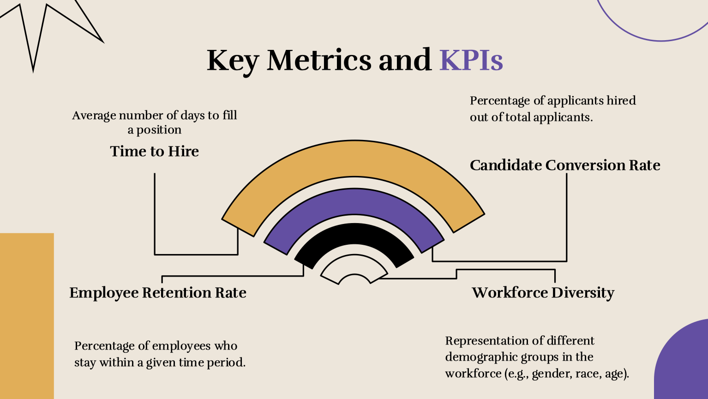
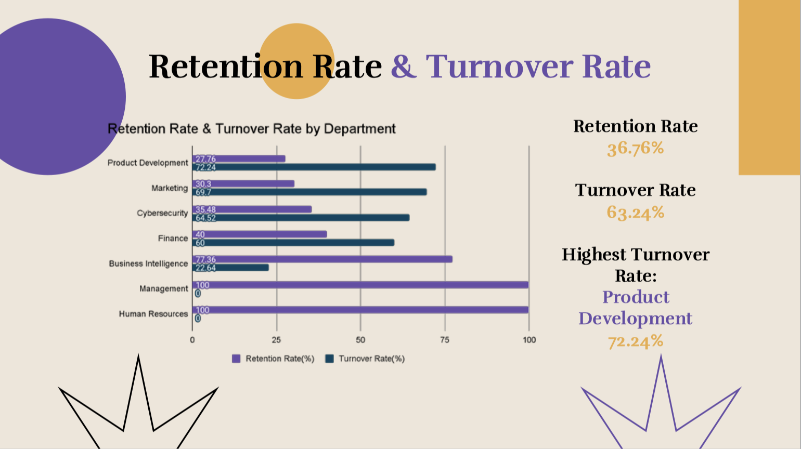

# HR Analytics Dashboard – ReDI School Project

## 📘 Project Overview

This HR analytics project was developed as part of the **Data Analytics course at ReDI School (2024 Fall)**. The objective was to analyze and visualize HR-related data using Power BI, and generate actionable insights for areas such as recruitment, retention, diversity, and workforce planning.

The dataset was AI-generated and provided by the instructor.

> This was a group project. The Power BI dashboard included here reflects the portion I contributed to.

---

## 📸 Previews

<div style="display: flex; gap: 10px;">
    
    
</div>

---

## 📊 Key KPIs

- Time to Hire
- Candidate Conversion Rate
- Retention & Turnover Rates
- Tenure and Promotion Analysis
- Workforce Demographics and Diversity
- Resignation Trends

---

## 📁 Repository Structure

```bash
hr-analytics-redi/
├── data/ # Raw CSV files used in the analysis
├── powerbi/ # Power BI dashboard (.pbix)
├── report/ # PDF presentation slides
└── README.md # Project description and instructions
```

---

## 📄 Files

- `powerbi/MiniProject.pbix`: Partial Power BI file from group dashboard
- `data/`: CSV files used in analysis (mock data)
- `report/executive_summary.pdf`: Summary of key insights & recommendations
- `report/presentation_slides.pdf`: Slides used in final group presentation

---

## 💡 Next Steps

A Python-based version of the same project is under development in the `python-version/` branch (coming soon).

---

## 👤 Author

This project (PowerBI Version) was completed Natalia Ramos, Jianxin Zhao, Aleksandra Laskowska at ReDI School (2024 Fall).
The repository was created and maintained by Jianxin.
